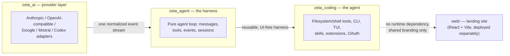
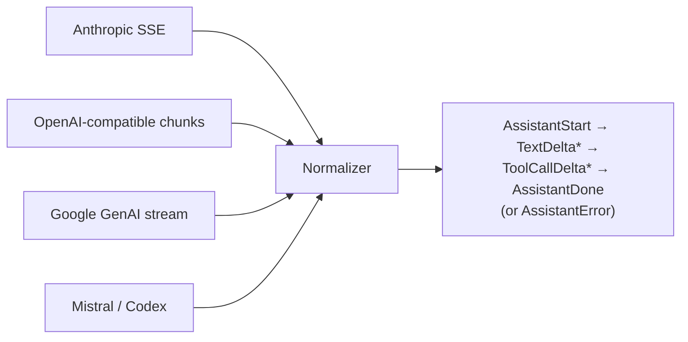
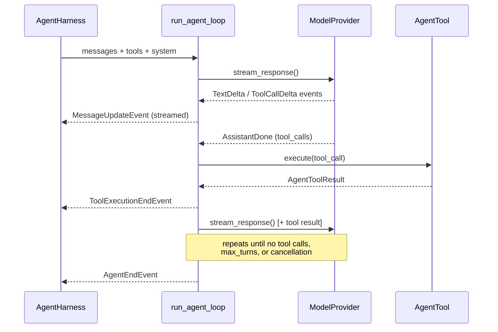
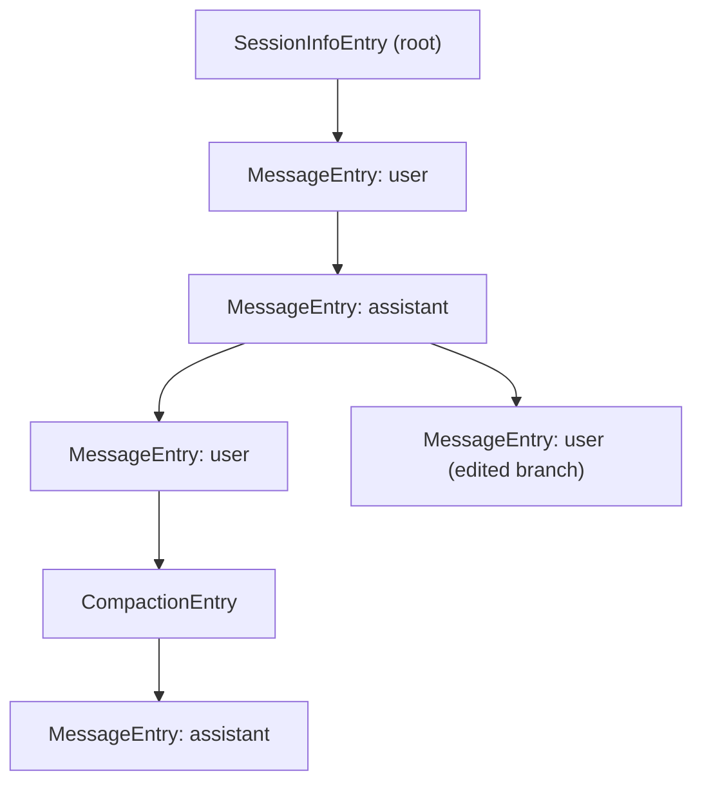
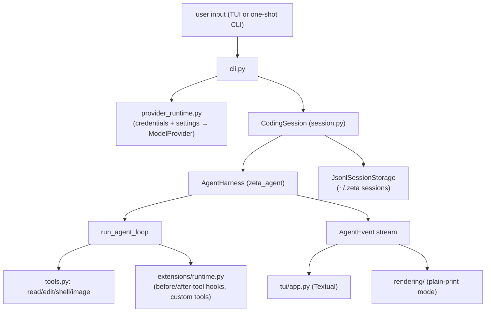

# Zeta — Architecture, from first principles

Zeta is a minimalist, Pi-style coding-agent harness. This doc explains the system
the way it's actually built: three small Python packages with a strict dependency
direction, plus a separate static landing site. For each layer we ask **why** it
exists, **what** it owns, and **how** it works — then show the shape as a diagram.

## The one-sentence architecture

> Normalize model output → drive a provider-agnostic tool loop → wrap that loop
> in coding policy (files, shell, sessions, extensions, TUI).

**Why this shape:** each layer is only allowed to depend on the one below it,
never sideways or up. `zeta_ai` doesn't know an agent loop exists; `zeta_agent`
doesn't know what a shell tool or a terminal UI is. That's what makes the
harness portable and the provider layer swappable without touching agent logic.

---

## Layer 1 — `zeta_ai`: the provider layer

**Why.** Every model API streams differently — different event names, different
tool-call framing, different error shapes (Anthropic SSE vs. OpenAI-compatible
chunks vs. Google's protocol). Nothing above this layer should have to know
that. `zeta_ai` exists purely to absorb that variance.

**What.** A `ModelProvider` protocol (re-exported from `zeta_agent`, since the
contract is *owned* by the harness, not the provider layer) and one adapter per
backend:

- `anthropic.py`, `google.py`, `mistral.py`, `openai_codex.py`,
  `openai_compatible.py`, `fake.py` (for tests)
- `retry.py` / `http_errors.py` / `http.py` — shared transport concerns
  (backoff, rate limits, timeouts)
- `model_limits.py` — context-window/token-limit metadata per model

**How.** Every adapter's job is the same: take a raw provider stream and emit
the *same* small vocabulary of events regardless of source.

Any provider can be added by writing one adapter that emits this event
contract — nothing downstream changes.

---

## Layer 2 — `zeta_agent`: the harness

**Why.** The actual "agent" behavior — turning model events into tool calls,
tool results back into messages, and looping until the model is done — is
provider-neutral and UI-neutral. Keeping it as its own package means it can be
reused (or open-sourced, tested, embedded) without dragging in a CLI, a
terminal renderer, or filesystem tools.

**What.**

- `provider.py` — the `ModelProvider` contract itself
- `messages.py` / `types.py` — wire-format message/content models
- `tools.py` — the `AgentTool` protocol + `AgentToolResult`
- `loop.py` — `run_agent_loop`: the pure request/response/tool-call loop
- `harness.py` — `AgentHarness`: a stateful wrapper around the loop (queues
  steering/follow-up messages, exposes an event-listener API)
- `session/` — append-only session tree: `entries.py` (typed entry kinds),
  `jsonl.py` (serialization), `storage.py` (the `SessionStorage` protocol +
  JSONL implementation), `tree.py` (path-to-leaf traversal), `memory.py`
  (in-process `SessionState`)

**How.** One turn of the loop:

Sessions are an **append-only tree**, not a flat transcript: every entry
(`MessageEntry`, `CompactionEntry`, `BranchSummaryEntry`, `ModelChangeEntry`,
`ThinkingLevelChangeEntry`, ...) is immutable and references its parent, so a
session can branch (edit-and-retry, alternate turns) and a JSONL file replays
into that tree deterministically.

---

## Layer 3 — `zeta_coding`: the agent

**Why.** This is where "generic tool-calling harness" becomes "a coding
agent": real filesystem/shell tools, a CLI entry point, a TUI, provider
credentials/OAuth, skills, and an extension system. It's deliberately the
*only* layer allowed to know about the local machine, the terminal, or the
user's config directory.

**What.**

- `cli.py` — Typer entry point (`zeta` command), wires provider settings,
  credentials, and either prints or launches the TUI
- `tools.py` — the actual filesystem/shell `AgentTool` implementations (read,
  edit, shell exec with cancellation, image processing, etc.)
- `session.py` / `session_manager.py` / `session_export.py` — `CodingSession`
  wraps `AgentHarness` with terminal-command parsing, compaction, branch
  summaries, and export to shareable artifacts
- `provider_config.py` / `provider_runtime.py` / `credentials.py` /
  `oauth*.py` — turns user settings + stored OAuth/API-key credentials into a
  concrete `zeta_ai` provider instance
- `skills.py` — markdown-defined skills, loaded and expanded into prompts
- `extensions/` — `loader.py` (discovery), `runtime.py` (hook dispatch, tool
  wrapping, session binding), `api.py` (the extension-facing types/protocols)
- `tui/` — the Textual terminal UI: `app.py`, `widgets.py`, `autocomplete.py`,
  `state.py`, `themes/`
- `context.py` / `context_window.py` / `thinking.py` — prompt assembly,
  context-budget management, reasoning-effort control

**How.** Everything below the CLI/TUI boundary is policy on top of the
harness — it configures tools and a provider, then just drives
`AgentHarness`:

Skills and extensions are both **markdown/plugin discovery mechanisms**
layered on top of the same tool/hook surface — a skill expands into prompt
text via `skills.py`; an extension can register new `AgentTool`s or hook into
`before_tool_call`/`after_tool_call` via `extensions/runtime.py`. Neither
requires touching `zeta_agent`.

---

## `web/` — the landing site

Not part of the runtime at all: a separate React + Vite app (`web/`) that
renders the marketing/install page and is deployed independently. It shares
no code with the three Python packages — only branding and copy.

---

## Why the three-package split earns its cost

| Layer | Knows about | Must never know about |
|---|---|---|
| `zeta_ai` | Provider wire formats, HTTP/retry | Tools, sessions, the CLI |
| `zeta_agent` | Messages, tools, loop, sessions | The filesystem, shell, Textual, OAuth |
| `zeta_coding` | The local machine, terminal, credentials | Provider-specific wire formats |

This is what lets `zeta_ai` and `zeta_agent` be reused as standalone,
UI-independent packages (per `pyproject.toml`'s three separately-built wheel
packages), while all the messy, host-specific decisions stay quarantined in
`zeta_coding`.
